<p align="center">
  
</p>

<p align="center">
  <a href="https://lucas-portfolio-opal.vercel.app"></a>&nbsp;
  <a href="https://www.linkedin.com/in/lucas-silva-dos-santos-31026726a"></a>&nbsp;
  <a href="mailto:lucassilvadossantos2005@gmail.com"></a>&nbsp;
  <a href="https://www.instagram.com/dev.lucassilva.ss/"></a>
</p>

<br>

<picture>
  <source media="(prefers-color-scheme: dark)" srcset="assets/sec-about.svg">
  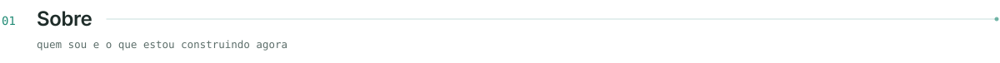
</picture>

Desenvolvedor full stack e mobile, programando desde 2021. Atuo em todo o ciclo do produto — modelagem de dados, APIs, interface e deploy — e sou cofundador da **CalmDev**, onde desenvolvo sistemas para empresas desde 2023. Antes do código vieram sete anos de design gráfico e audiovisual, e é por isso que eu me importo tanto com o acabamento do que entrego.

```ts
const lucas = {
  role: "Full Stack & Mobile Developer",
  location: "Alfenas, MG — Brasil",
  codingSince: 2021,
  stack: ["React", "Next.js", "TypeScript", "Node.js", "Java", "Flutter"],
  now: ["CalmDev (cofundador)", "Conecta Cidade — app na Google Play", "Ciência da Computação @ Unifenas"],
  openTo: ["remoto", "híbrido", "presencial", "mudança de cidade"],
};
```

<br>

<picture>
  <source media="(prefers-color-scheme: dark)" srcset="assets/sec-stats.svg">
  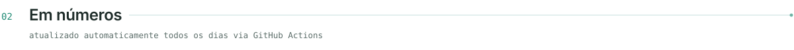
</picture>

<p align="center">
  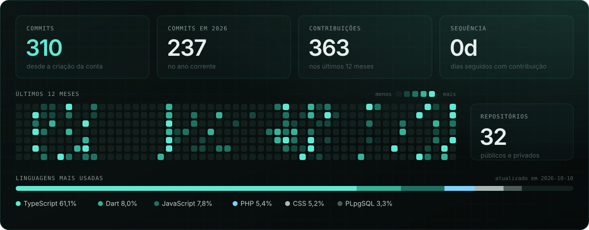
</p>

<br>

<picture>
  <source media="(prefers-color-scheme: dark)" srcset="assets/sec-stack.svg">
  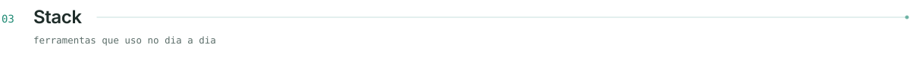
</picture>

<p align="center">
  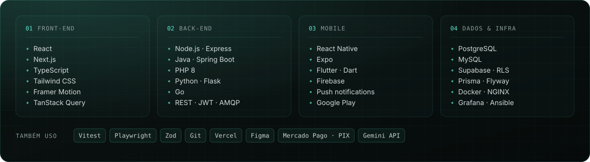
</p>

<br>

<picture>
  <source media="(prefers-color-scheme: dark)" srcset="assets/sec-projects.svg">
  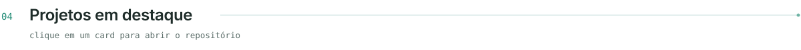
</picture>

<p align="center">
  <a href="https://github.com/lucas-s-santos/ticketflow">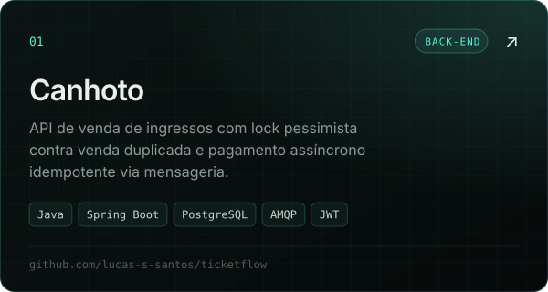</a>
  <a href="https://portal-conectacidade.vercel.app">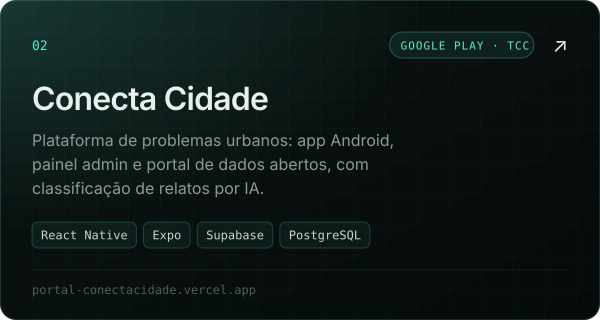</a>
</p>
<p align="center">
  <a href="https://github.com/lucas-s-santos/store-fanatic">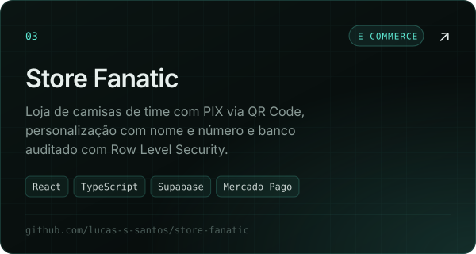</a>
  <a href="https://github.com/lucas-s-santos/nexfinance">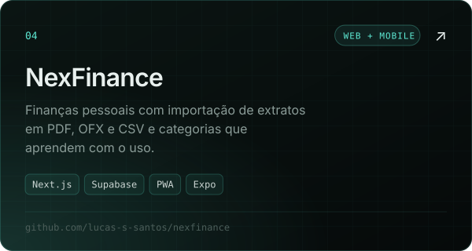</a>
</p>
<p align="center">
  <a href="https://github.com/lucas-s-santos/Calm-Cup">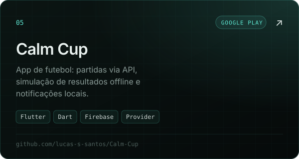</a>
  <a href="https://github.com/lucas-s-santos/KORPdevops">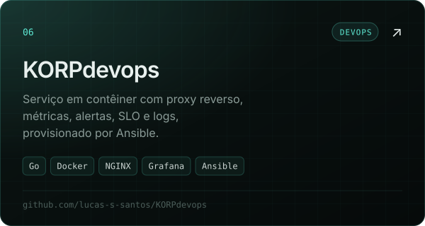</a>
</p>

<details>
<summary><b>Outros projetos</b></summary>
<br>

| Projeto | O que é | Stack |
|---|---|---|
| [Revelado](https://github.com/lucas-s-santos/revelado) | SaaS de páginas comemorativas com QR Code e pagamento via Pix | Next.js · Prisma · Cloudflare R2 · Mercado Pago |
| Vital Aço *(privado · cliente real)* | Site de captação e painel de serviços, agenda e financeiro | Next.js · TypeScript · Supabase · Vitest |
| Invitly *(privado)* | SaaS de convites digitais animados com RSVP | React · TypeScript · Supabase |

Os cases completos dos projetos privados estão no [portfólio](https://lucas-portfolio-opal.vercel.app).

</details>

<br>

<picture>
  <source media="(prefers-color-scheme: dark)" srcset="assets/sec-principles.svg">
  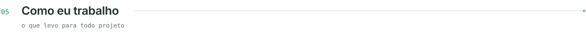
</picture>

<p align="center">
  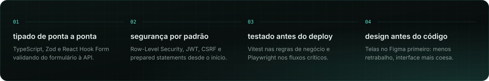
</p>

<br>

<picture>
  <source media="(prefers-color-scheme: dark)" srcset="assets/footer.svg">
  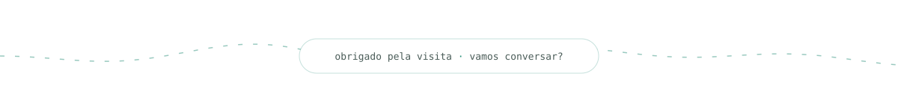
</picture>
